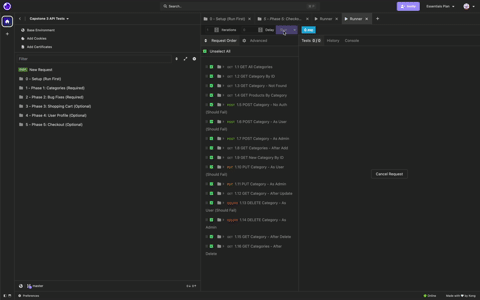

## Video Game Store API
The Video Game Store application allows users to browse a collection of video games available in the store. Users can explore games by category, genre, and price to easily find what they’re looking for.
Once logged in, users can add games to their cart, view the total cost, and decide whether to complete their purchase.

## User stories
- As a user, I want to view all game categories so I can browse games by type.
- As a user, I want to view a single game category to see its details.
- As a user, I want to see all games within a category so I can find games I’m interested in.
- As a user, I want to view the latest product list so I don’t see outdated or duplicate games.
- As a user, I want to filter or browse products based on available information so I can easily see what games are available.
- As a user, I want to add games to my cart so I can purchase them later.
- As a user, I want to update the quantity of items in my cart so I can adjust my order without repeatedly clicking buttons.
- As a user, I want to clear my cart so I can restart my shopping list.
- As a user, I want to update my profile details so my account reflects my correct information.
- As a user, I want to check out my cart so I can complete my purchase.
- 

# Setup

### Prerequisites

- IntelliJ IDEA: Ensure you have IntelliJ IDEA installed, which you can download from [here](https://www.jetbrains.com/idea/download/).
- Java SDK: Make sure Java SDK is installed and configured in IntelliJ.

### Running the Application in IntelliJ

Follow these steps to get your application running within IntelliJ IDEA:

1. Open IntelliJ IDEA.
2. Select "Open" and navigate to the directory where you cloned or downloaded the project.
3. After the project opens, wait for IntelliJ to index the files and set up the project.
4. Find the main class with the `public static void main(String[] args)` method.
5. Right-click on the file and select 'Run 'EasyshopApplication.main()'' to start the application.
6. Have to download the website in a separate folder, and open up index.html on IntelliJ.
7. While running, you have to make sure the API is running, and after that, you can enter data and search products up persistently.

## Technologies Used

- Java SDK 17
- IntelliJ IDEA
- MySQL Database
- Insomnia
- Spring Boot

## Demo

## Future versions:
- Future features:
    - Being able to search for an item.
    - More appealing front-end.

## Resources
- WorkBooks and Past Exercises
- [Dates and Times](https://docs.oracle.com/javase/8/docs/api/java/time/LocalDate.html)

## Special thanks to:
- My Peers!
- Special Thanks to Raymond, teaching me from basic loops to creating projects like this!
